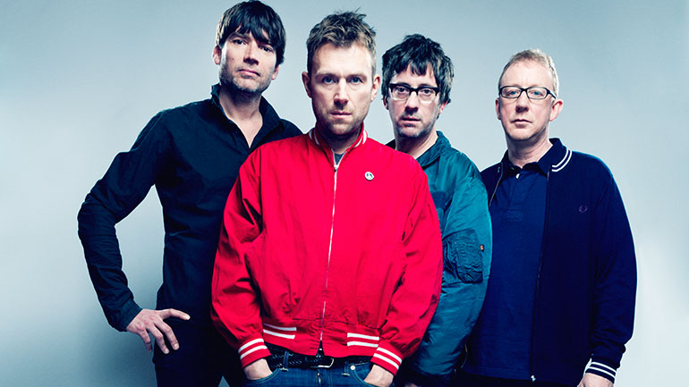
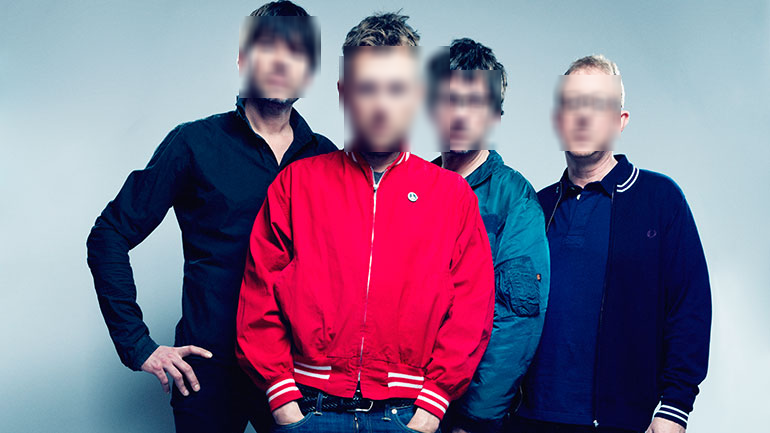
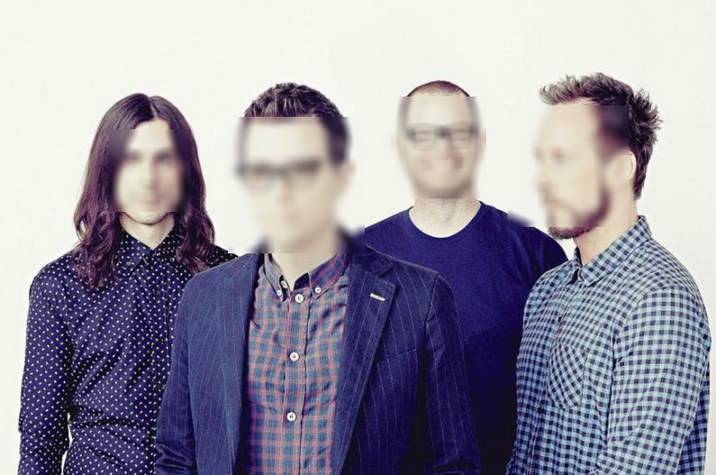

# OpenCV Face Blur
This repo shows a simple face detector and subsequent redaction from an image, using Python 3 and [OpenCV](https://opencv.org/) (for those who want to remain unseen).

## Face blur
Here we make use of two default HAAR cascade from the OpenCV library, one for front-on faces, and another for faces in profile. These cascades provide a good foundation for training your own, supposing you have your own training data. With that in mind, it would be beneficial to train a single HAAR cascade to include a range of faces, and possible positions (note the defaults don't perform well with angled faces, ie from below or above).

An example input, using an image of the band Blur from an article on [Mojo](https://www.mojo4music.com/articles/20051/blur-magic-whip)

Another example input, using an image of the band Weezer (no pun this time) from an article on [Consequence of Sound](https://consequenceofsound.net/2019/03/ranking-weezer-from-worst-to-best/)

The script then detects frontal and profile faces, before applying a [gaussian filter](https://opencv-python-tutroals.readthedocs.io/en/latest/py_tutorials/py_imgproc/py_filtering/py_filtering.html#image-blurring-image-smoothing) to each face, and adding the blur to the original image. This is then saved in the 'results' folder.

